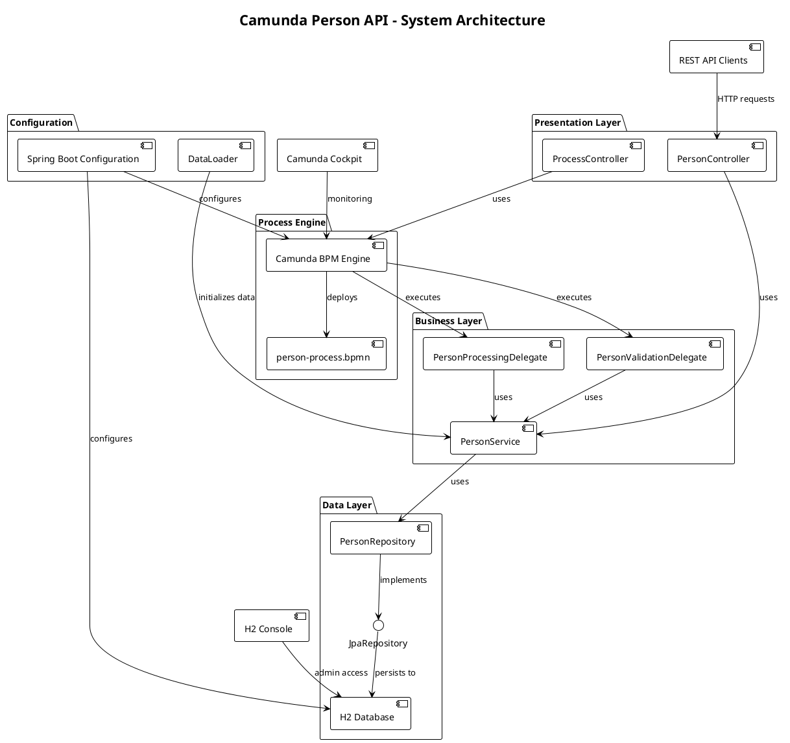
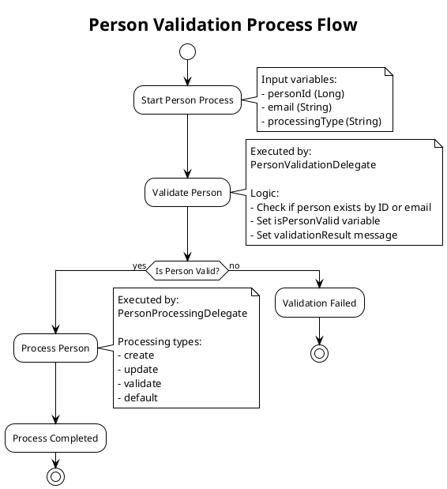
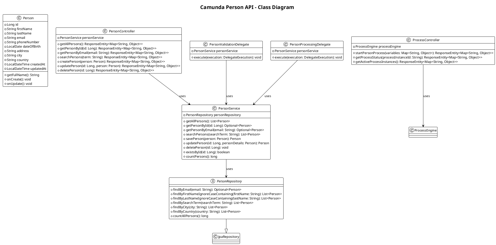
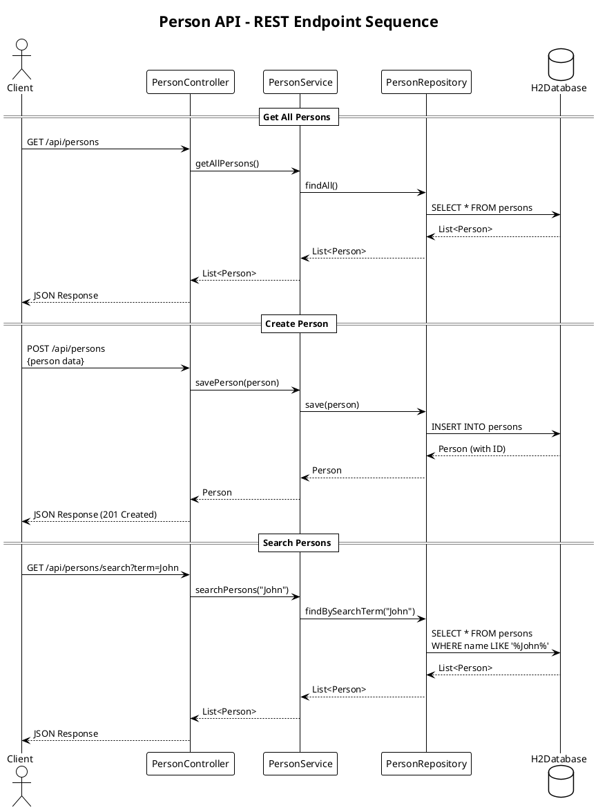
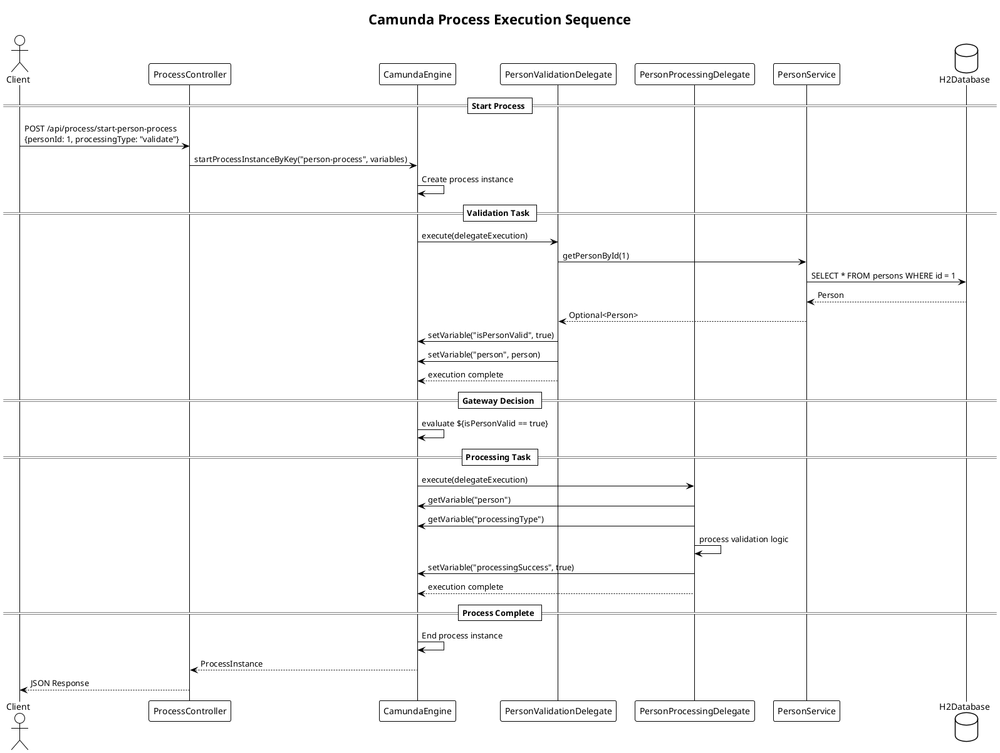
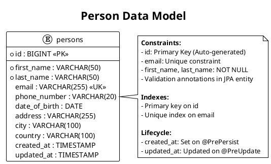
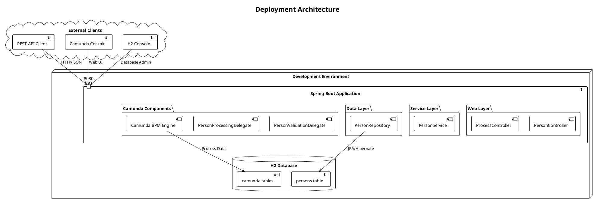
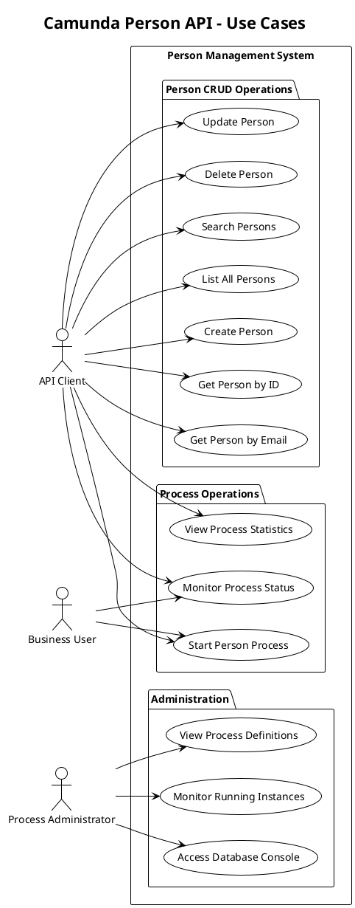

# Camunda Person API - PlantUML Documentation

This document contains PlantUML diagrams for the Camunda Person API project.

## 1. System Architecture Overview

## 2. BPMN Process Flow

## 3. Class Diagram - Domain Model

## 4. API Endpoints Sequence Diagram

## 5. Camunda Process Execution Sequence

## 6. Data Model ERD

## 7. Component Deployment Diagram

## 8. Use Case Diagram

## Usage Instructions

To render these PlantUML diagrams:

1. **In VS Code**: Install the PlantUML extension and use Ctrl+Shift+P → "PlantUML: Preview Current Diagram"
2. **Online**: Copy the diagram code to http://www.plantuml.com/plantuml/
3. **CLI**: Use PlantUML JAR to generate images: `java -jar plantuml.jar documentation.md`

Each diagram provides a different perspective on the system architecture and can be used for:
- **Development**: Understanding code structure and relationships
- **Documentation**: Technical documentation for the project
- **Communication**: Explaining the system to stakeholders
- **Maintenance**: Visual reference for future modifications