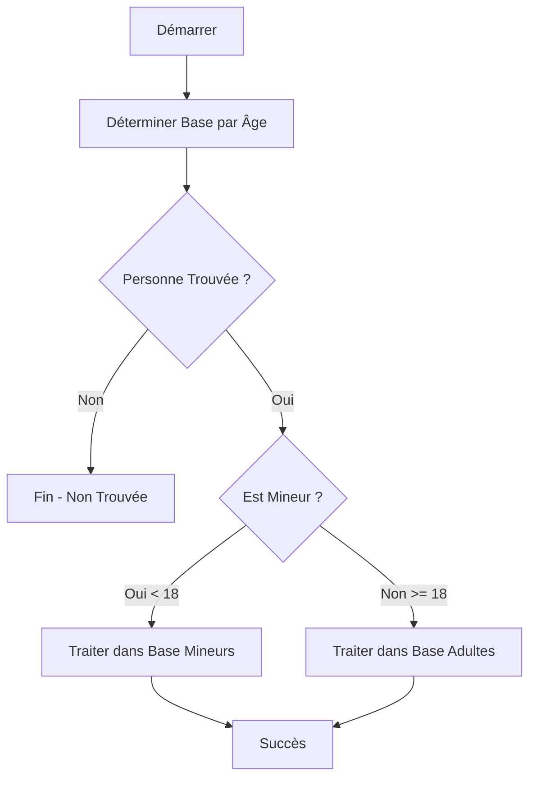

# Camunda Person API - Système Multi-Bases par Âge 🎂

## 📋 Description du Système

Cette application Spring Boot + Camunda implémente un système innovant de gestion des personnes avec **routage automatique par âge** :

- **🧑‍🦳 Base Adultes (18+)** : Base principale contenant les tables Camunda + personnes adultes
- **🧒 Base Mineurs (-18)** : Base séparée dédiée uniquement aux personnes mineures
- **🔄 Routage Automatique** : Les personnes sont automatiquement dirigées vers la bonne base selon leur âge

## 🏗️ Architecture Multi-Bases

```
┌─────────────────────────────────────────────┐
│           BASE PRINCIPALE (main_db)         │
│  ┌─────────────────┐  ┌─────────────────┐   │
│  │  Tables Camunda │  │ Personnes 18+   │   │
│  │  (ACT_*, etc.)  │  │   (Adultes)     │   │
│  └─────────────────────└─────────────────┘   │
└─────────────────────────────────────────────┘
                    ▲
                    │ Routage par âge
                    ▼
┌─────────────────────────────────────────────┐
│           BASE MINEURS (minors_db)          │
│             ┌─────────────────┐             │
│             │ Personnes -18   │             │
│             │   (Mineurs)     │             │
│             └─────────────────┘             │
└─────────────────────────────────────────────┘
```

## 🚀 Démarrage Rapide

### 1. **Démarrer l'Application**
```bash
mvn spring-boot:run
```

### 2. **Accès aux Interfaces**

| Interface | URL | Identifiants |
|-----------|-----|--------------|
| 🌐 **API REST** | `http://localhost:8080/api/persons` | - |
| 🎛️ **Camunda Cockpit** | `http://localhost:8080/camunda/app/cockpit` | demo/demo |
| 🗄️ **Console H2 Adultes** | `http://localhost:8080/h2-console` | JDBC: `jdbc:h2:mem:main_db` |
| 🗄️ **Console H2 Mineurs** | `http://localhost:8080/h2-console` | JDBC: `jdbc:h2:mem:minors_db` |

### Running the Application

## 📊 Endpoints API Étendus

### **Endpoints Classiques**
| Méthode | Endpoint | Description |
|---------|----------|-------------|
| `GET` | `/api/persons` | Toutes les personnes (adultes + mineurs) |
| `GET` | `/api/persons/{id}` | Personne par ID (recherche dans les 2 bases) |
| `POST` | `/api/persons` | Créer une personne (routage automatique) |

### **🆕 Nouveaux Endpoints par Âge**
| Méthode | Endpoint | Description |
|---------|----------|-------------|
| `GET` | `/api/persons/adults` | **Adultes uniquement** (18+) |
| `GET` | `/api/persons/minors` | **Mineurs uniquement** (-18) |
| `GET` | `/api/persons/statistics` | **Statistiques des 2 bases** |
| `GET` | `/api/persons/{id}/age-info` | **Infos d'âge et base cible** |

### **🔄 Processus Camunda par Âge**
| Méthode | Endpoint | Description |
|---------|----------|-------------|
| `POST` | `/api/process/age-routing/start` | **Démarrer processus de routage par âge** |
| `GET` | `/api/process/age-routing/status/{id}` | **Statut du processus** |
| `GET` | `/api/process/age-routing/active` | **Processus actifs** |
| `GET` | `/api/process/age-routing/statistics` | **Statistiques des processus** |

## 📝 Exemples d'Utilisation

### **1. Récupérer les Statistiques**
```bash
curl http://localhost:8080/api/persons/statistics
```
**Réponse :**
```json
{
  "success": true,
  "statistics": {
    "adults": 5,
    "minors": 5, 
    "total": 10,
    "adultsPercentage": 50.0,
    "minorsPercentage": 50.0
  }
}
```

### **2. Créer une Personne (Routage Automatique)**
```bash
curl -X POST http://localhost:8080/api/persons \
  -H "Content-Type: application/json" \
  -d '{
    "firstName": "Sophie",
    "lastName": "Dupuis", 
    "email": "sophie.dupuis@example.com",
    "dateOfBirth": "2010-05-15"
  }'
```
> ⚡ **Automatiquement routée vers la base MINEURS** (13 ans)

### **3. Démarrer un Processus de Routage par Âge**
```bash
curl -X POST http://localhost:8080/api/process/age-routing/start \
  -H "Content-Type: application/json" \
  -d '{
    "personId": 1
  }'
```

### **4. Récupérer les Adultes Uniquement**
```bash
curl http://localhost:8080/api/persons/adults
```

### **5. Vérifier l'Âge et la Base Cible**
```bash
curl http://localhost:8080/api/persons/1/age-info
```
**Réponse :**
```json
{
  "success": true,
  "person": {
    "id": 1,
    "fullName": "John Doe",
    "age": 34,
    "isMinor": false,
    "targetDatabase": "ADULTS"
  }
}
```

## 🎯 Processus BPMN de Routage par Âge

Le nouveau processus `age-based-routing-process` suit cette logique :
  "dateOfBirth": "1985-03-15",
  "address": "456 Oak Ave",
  "city": "Los Angeles",
  "country": "USA"
}
```



## 🗄️ Données de Test Pré-chargées

### **Adultes (Base Principale)**
| Nom | Âge | Email |
|-----|-----|-------|
| John Doe | 34 ans | john.doe@example.com |
| Jane Smith | 39 ans | jane.smith@example.com |
| Bob Johnson | 32 ans | bob.johnson@example.com |
| Alice Brown | 36 ans | alice.brown@example.com |
| Marie Dupont | 18 ans | marie.dupont@example.com |

### **Mineurs (Base Séparée)**
| Nom | Âge | Email |
|-----|-----|-------|
| Emma Martin | 14 ans | emma.martin@example.com |
| Lucas Bernard | 16 ans | lucas.bernard@example.com |
| Chloe Moreau | 17 ans | chloe.moreau@example.com |
| Hugo Leroy | 12 ans | hugo.leroy@example.com |
| Léa Petit | 15 ans | lea.petit@example.com |

## ⚙️ Configuration des Bases de Données

```yaml
spring:
  # Base principale (Camunda + Adultes)
  datasource:
    url: jdbc:h2:mem:main_db
    username: sa
    password: ""
  
  # Base séparée pour les mineurs
  minors-datasource:
    url: jdbc:h2:mem:minors_db
    username: sa
    password: ""
```

## 🔧 Services Techniques

### **PersonService** (Classique)
- Gère la base principale avec JPA Repository
- Utilisé pour les opérations CRUD standards

### **AgeBasedPersonService** (Nouveau)
- Gère les deux bases avec JdbcTemplate
- Routage automatique selon l'âge
- Méthodes :
  - `savePerson()` - Routage automatique
  - `getAllAdults()` / `getAllMinors()`
  - `calculateAge()` / `isMinor()`
  - Statistiques des deux bases

### **AgeBasedRoutingDelegate** (Camunda)
- Délégué BPMN pour le routage par âge
- Variables de processus exposées :
  - `isMinor` (boolean)
  - `targetDatabase` (ADULTS/MINORS)
  - `personAge` (integer)
  - `routingResult` (string)

## 🛠️ Développement et Tests

### **Compiler et Tester**
```bash
mvn clean compile
mvn clean package -DskipTests
mvn spring-boot:run
```

### **Accéder aux Consoles de Base de Données**
1. **Base Principale** : `jdbc:h2:mem:main_db` (Camunda + Adultes)
2. **Base Mineurs** : `jdbc:h2:mem:minors_db` (Mineurs uniquement)

### **Surveiller les Processus**
- Camunda Cockpit : Voir les instances actives du processus `age-based-routing-process`
- API Statistics : Suivre les métriques de routage

## 📈 Avantages du Système

✅ **Séparation des Données** : Protection des données des mineurs
✅ **Performance** : Bases spécialisées pour différents types d'utilisateurs  
✅ **Conformité** : Respect des réglementations sur les données des mineurs
✅ **Routage Automatique** : Pas de gestion manuelle des bases
✅ **Processus Métier** : Workflow Camunda intelligent par âge
✅ **Monitoring** : Statistiques détaillées et processus traçables

## 🔮 Évolutions Possibles

- 📧 Notifications automatiques lors des changements de base (18 ans)
- 🔒 Authentification différenciée par âge
- 📊 Dashboard de monitoring en temps réel
- 🌍 Support multi-locataire par pays/région
- 🔄 Migration automatique des données à la majorité

---

**🎉 Votre système Camunda multi-bases par âge est prêt !**

Testez les nouvelles fonctionnalités et explorez les processus BPMN intelligents ! 🚀


## License

This project is for demonstration purposes.